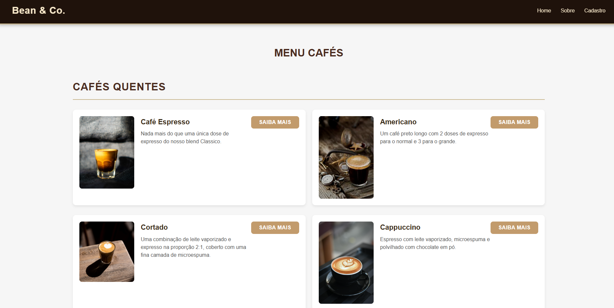
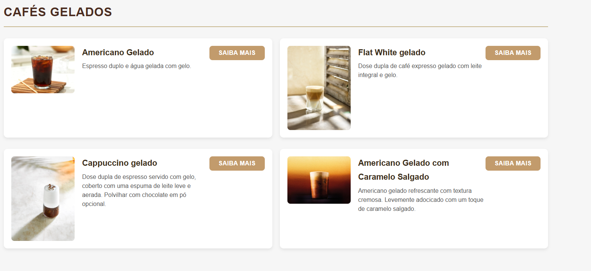
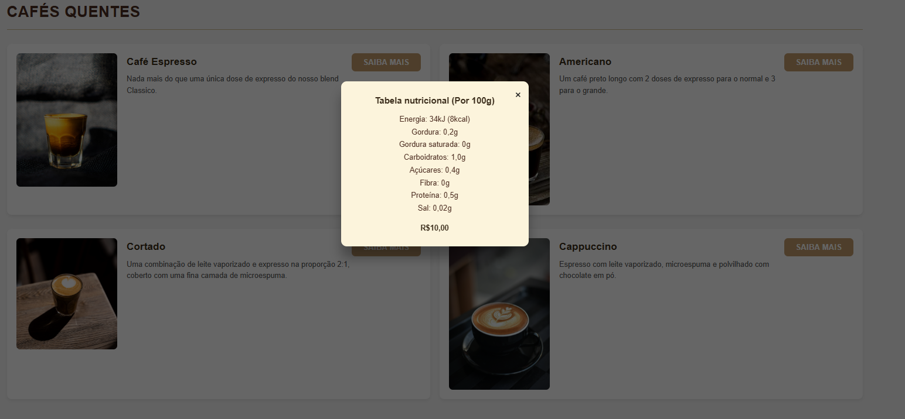
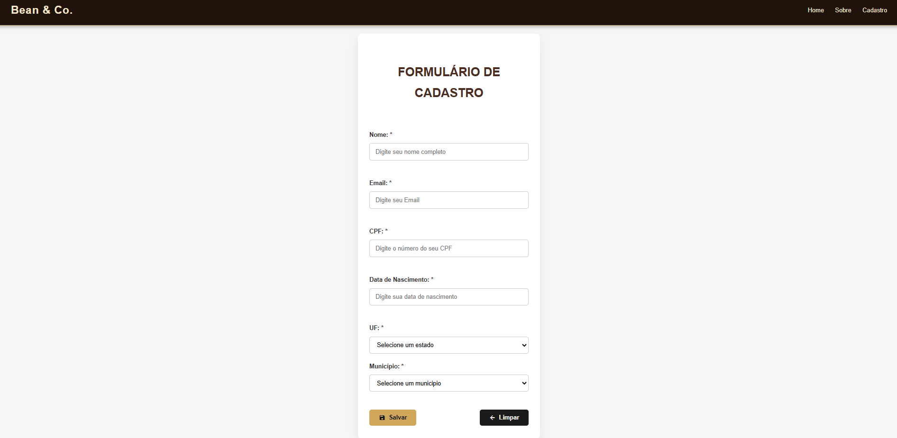
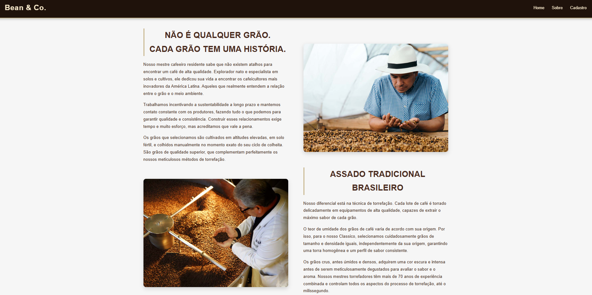

Bean & Co.
Project Description

Bean & Co. is a fictional coffee shop website that showcases a menu of hot and iced coffees, company information, and a customer registration form. The site features a responsive, modern interface with interactive modals for nutritional information and simple page navigation.

Technologies Used

Front-end:

HTML5

CSS3 (responsive design)

JavaScript (for modals and form handling)

Back-end:

Node.js (HTTP server)

File System module (serving static files)

Additional resources:

Google Material Icons

Images of coffee and roasting process

Project Structure
├── index.html           # Home page and coffee menu
├── about.html           # "About" page
├── form.html            # Customer registration form
├── css/
│   └── style.css        # General styles
├── js/
│   └── script.js        # JavaScript functions (modals, forms, navigation)
├── img/                 # Site images
├── server.js            # Node.js server
└── README.md            # This file

Features
Coffee Menu

Displays hot and iced coffees in cards with image, description, and a "Learn More" button.

Clicking "Learn More" opens a modal with detailed nutritional information.

Customer Registration Form

Collects customer information: name, email, CPF, birth date, state, and city.

Buttons for saving or clearing the form.

Responsive design for mobile and desktop devices.

About Page

Detailed information about the company’s history and coffee roasting process.

Layout divided into text and image sections, modern and responsive design.

Node.js Server

Basic HTTP server for serving static files (HTML, CSS, JS, images).

Default port: 3000

Supports multiple MIME types (.html, .css, .js, .png, .jpg, .ico, etc.)

How to Run the Project

Clone the repository:

git clone <REPOSITORY_URL>

Install Node.js (if not already installed):
https://nodejs.org

Start the server:

node server.js

Open the site:

Open your browser and go to: http://localhost:3000

Notes

The website is static, but the registration form can be integrated with a back-end to save data in a database.

Images and icons can be replaced as needed.

The CSS is designed for responsiveness on tablets and mobile devices.
